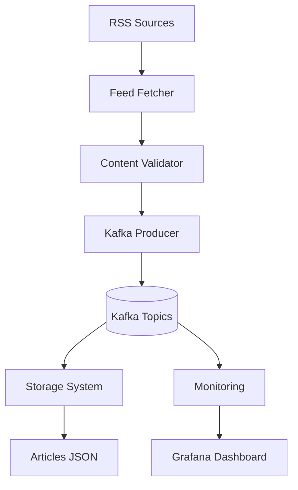
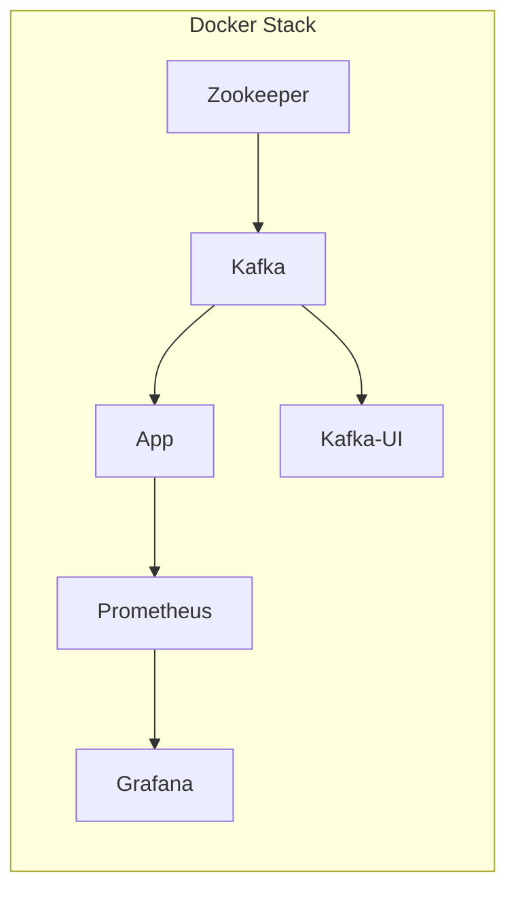
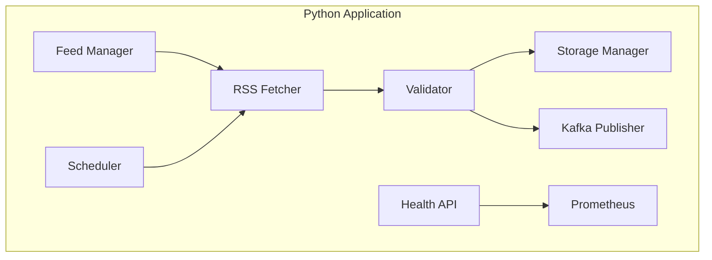
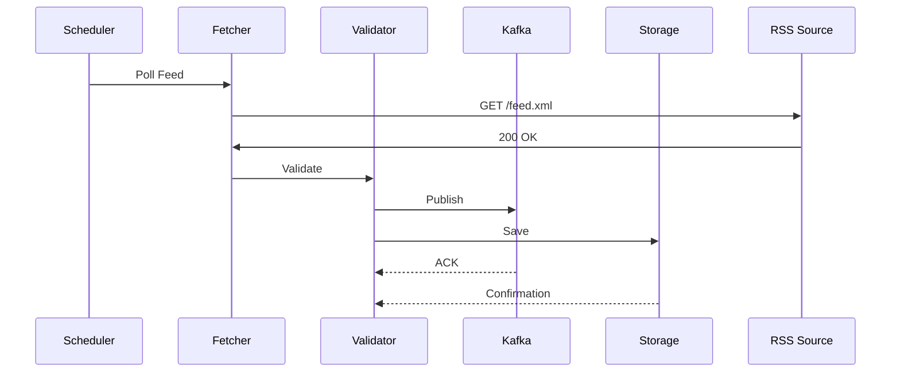
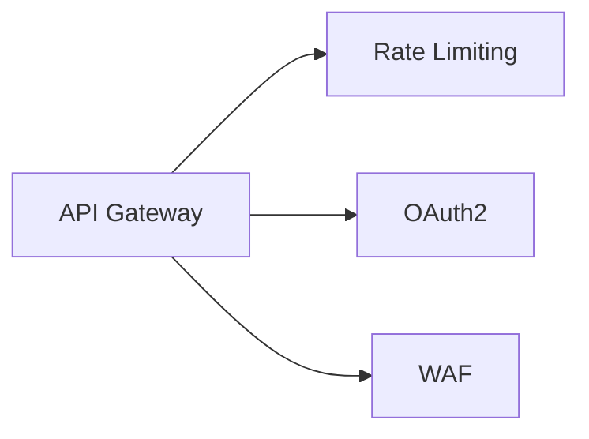

# RSS Feed Aggregator System - Comprehensive Documentation

## Table of Contents
1. [System Overview](#system-overview)
2. [Architecture Design](#architecture-design)
3. [Core Components](#core-components)
4. [Data Flow](#data-flow)
5. [API Documentation](#api-documentation)
6. [Monitoring & Observability](#monitoring--observability)
7. [Deployment Guide](#deployment-guide)
8. [Areas for Improvement](#areas-for-improvement)
9. [Security Considerations](#security-considerations)
10. [Troubleshooting Guide](#troubleshooting-guide)

## System Overview

The RSS Feed Aggregator is a real-time data pipeline that:
- Collects articles from 17+ news sources
- Validates and processes content
- Stores articles in structured format
- Streams data to Kafka topics
- Provides monitoring endpoints

**Key Features**:
- Adaptive polling intervals (5-60 minutes)
- Content validation and filtering
- Dead letter queue for failed articles
- Health monitoring dashboard
- Prometheus/Grafana integration

## Architecture Design

### High-Level Architecture



### Container Architecture



### Component Diagram



## Core Components

### 1. Feed Manager
- **Purpose**: Manages feed configurations and priorities
- **Key Features**:
  - Loads feed definitions from JSON
  - Handles adaptive polling intervals
  - Tracks feed health statistics

### 2. RSS Fetcher
- **Protocols**: HTTP/HTTPS with ETag/Last-Modified
- **Headers**:
  ```python
  {
    "User-Agent": "RSSAggregator/1.0",
    "Accept": "application/rss+xml",
    "If-None-Match": "<etag>",
    "If-Modified-Since": "<timestamp>"
  }
  ```

### 3. Content Validator
- **Validation Rules**:
  - Required fields: `title`, `link`, `published`
  - Content quality checks
  - Duplicate detection

### 4. Kafka Publisher
- **Topics**:
  - `rss_articles` (valid articles)
  - `dead_letter` (failed articles)
- **Configuration**:
  ```python
  {
    "bootstrap_servers": "kafka:9092",
    "retries": 3,
    "compression_type": "gzip"
  }
  ```

### 5. Storage Manager
- **Storage Layout**:
  ```
  data/
  ├── raw_feeds/       # Original XML
  ├── parsed_articles/ # Processed JSON
  └── logs/            # System logs
  ```

## Data Flow

### Normal Operation
1. Scheduler triggers feed poll
2. Fetcher retrieves content with conditional GET
3. Validator checks article structure
4. Kafka Producer streams to topics
5. Storage Manager persists data



## API Documentation

### Health API (`/health`)
| Endpoint       | Method | Description                     |
|----------------|--------|---------------------------------|
| `/`            | GET    | Basic health status             |
| `/detailed`    | GET    | Comprehensive system health     |
| `/metrics`     | GET    | Prometheus metrics              |

**Sample Response**:
```json
{
  "status": "healthy",
  "timestamp": "2023-05-15T12:00:00Z",
  "services": {
    "kafka": true,
    "storage": true
  }
}
```

## Monitoring & Observability

### Metrics Collected
| Metric Name                     | Type      | Description                     |
|---------------------------------|-----------|---------------------------------|
| rss_feeder_feeds_total          | Gauge     | Number of configured feeds      |
| rss_feeder_articles_processed   | Counter   | Articles processed by status    |
| rss_feeder_request_latency      | Histogram | API request latency             |

### Grafana Dashboard
Includes:
- Feed polling statistics
- Kafka topic metrics
- System resource usage
- Error rates

## Deployment Guide

### Prerequisites
- Docker 20.10+
- docker-compose 1.29+
- 4GB RAM minimum

### Deployment Steps
1. Clone repository:
   ```bash
   git clone https://github.com/your/repo.git
   cd rss-aggregator
   ```

2. Configure environment:
   ```bash
   cp .env.example .env
   # Edit .env file
   ```

3. Start services:
   ```bash
   docker-compose up -d --build
   ```

4. Verify deployment:
   ```bash
   docker-compose ps
   curl http://localhost:8000/health
   ```

### Access Interfaces
| Service    | URL                     | Credentials       |
|------------|-------------------------|-------------------|
| Application| http://localhost:8000   | -                 |
| Grafana    | http://localhost:3000   | admin/admin       |
| Kafka UI   | http://localhost:8080   | -                 |
| Prometheus | http://localhost:9090   | -                 |

## Areas for Improvement

### 1. Scalability Enhancements
- **Current**: Single process architecture
- **Improvement**: 
  ```mermaid
  graph TB
    A[Load Balancer] --> B[Worker 1]
    A --> C[Worker 2]
    A --> D[Worker N]
  ```

### 2. Data Storage
- **Current**: Filesystem storage
- **Improvement**: 
  - PostgreSQL for articles
  - S3 for raw XML

### 3. Error Handling
- **Current**: Basic retry logic
- **Improvement**:
  - Circuit breaker pattern
  - Exponential backoff

### 4. Security
- **Current**: Basic API key
- **Improvement**:
  - JWT authentication
  - Network policies

## Security Considerations

### Implemented Protections
- Non-root container execution
- API key authentication
- Network segmentation
- Volume encryption

### Recommended Additions


## Troubleshooting Guide

### Common Issues

| Symptom                      | Solution                      |
|------------------------------|-------------------------------|
| Kafka connection failures    | Check `KAFKA_ADVERTISED_LISTENERS` |
| Health endpoints not working | Verify FastAPI mounting       |
| Missing metrics              | Check Prometheus scrape config|

### Diagnostic Commands
```bash
# Check container logs
docker-compose logs -f app

# Test Kafka connectivity
docker-compose exec app \
  python -c "from kafka import KafkaProducer; \
  print(KafkaProducer(bootstrap_servers=['kafka:9092']).bootstrap_connected())"

# Validate feeds.json
docker-compose exec app \
  python -c "import json; json.load(open('rss_feeder/feeds.json'))"
```

## Conclusion

This RSS Feed Aggregator provides a robust foundation for news collection and processing. The current architecture supports:

- Reliable feed ingestion
- Content validation
- Multiple output sinks
- Comprehensive monitoring

Key future improvements would focus on horizontal scaling, enhanced storage, and advanced security features.

---

**Appendix**:
- [Sample feeds.json](./examples/feeds.json)
- [Grafana Dashboard Template](./monitoring/grafana-dashboard.json)
- [Prometheus Alert Rules](./monitoring/alerts.yml)
